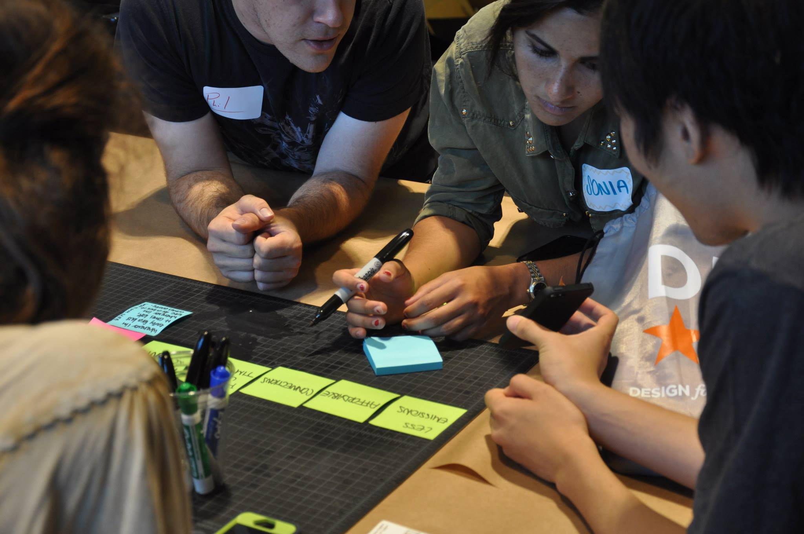

  

    

      
    

    

      
Design For America is a national network of university campus studios that advocate human-centered design among students and use design innovation for good within their communities. Learn more about what the organization through <a class="external link hover-red" href="http://designforamerica.com/what-we-do/" target="\_blank">the DFA website</a>.

      
(Thanks for the great memories, guys!)

    

    

      
    

    

      
    

    

      
National and regional conferences and meet-ups brought people across many backgrounds and disciplines together to learn, share, and build action networks.

    

    

      
    

    

      
    

    

      
For its 2013 leadership studio, Design For America partnered up with experts from the <a href="http://www.cnt.org" target="\_blank">Center for Neighborhood Technology</a> (CNT) and the Federal Emergency Management Agency (FEMA) for a weeklong design workshop to create concepts for addressing urban disasters, namely flooding.

      
A dozen residents of Midlothian, Illinois, volunteered as our community partners and gracefully invited us into their homes to hear their stories. Getting to understand them and their stories, ignored by the municipal government, was an exercise in user interviewing as well as compassion and empathy.

      
For our community partners, urban flooding is a serious, life-changing problem. It causes pervasive structural mold growth that endangers inhabitant respiratory health and can't easily be cleaned up with bleach. It destroys furniture and other possessions. It destroys home values and strands lower-income homeowners in virtually unsellable houses.

      
Throughout the workshop and design process, we continually received feedback and critique from our community and expert partners. My team capitalized on the finding that the Midlothian residents often had flood-fighting plans but were often caught off-guard by the unpredictable nature of flooding. We came up with a design for a smart sensor system that, when triggered, can alert homeowners

    

    

      
    

    

      
    

  

