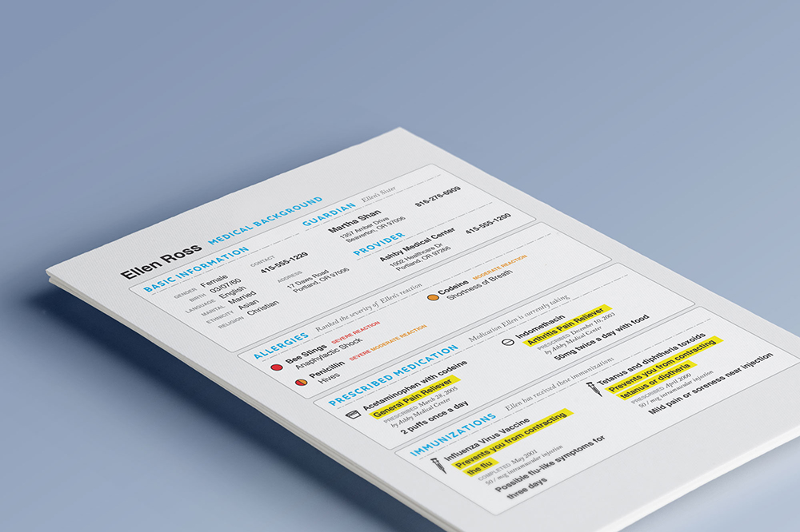
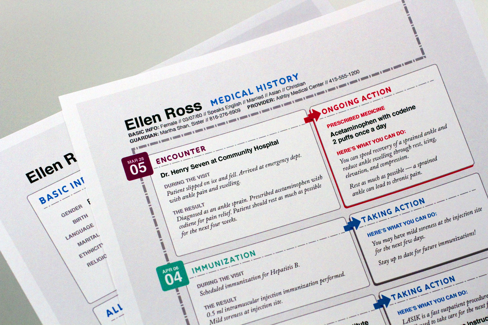
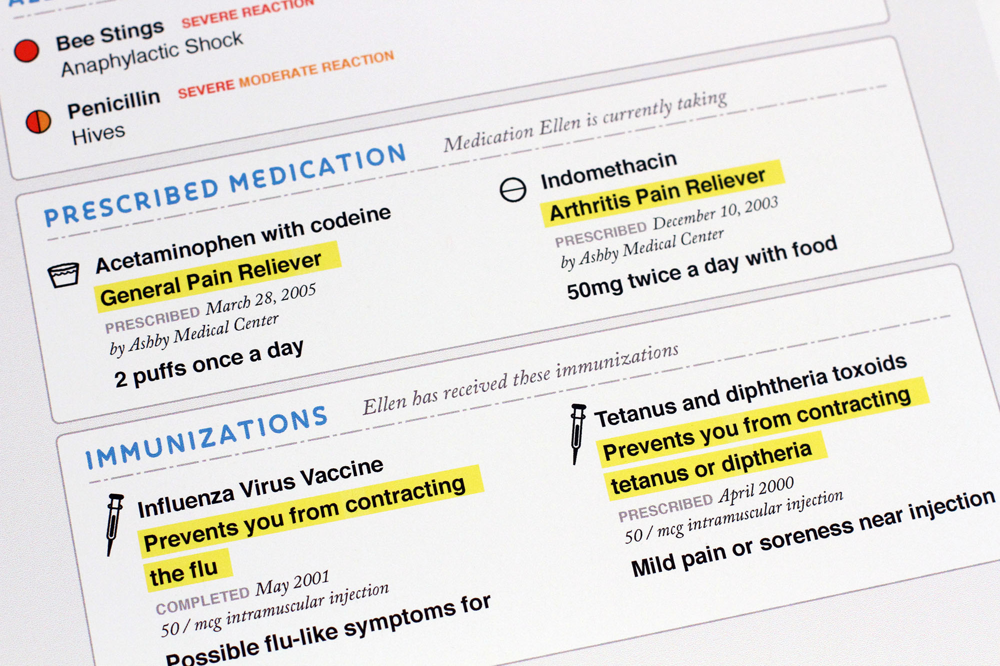
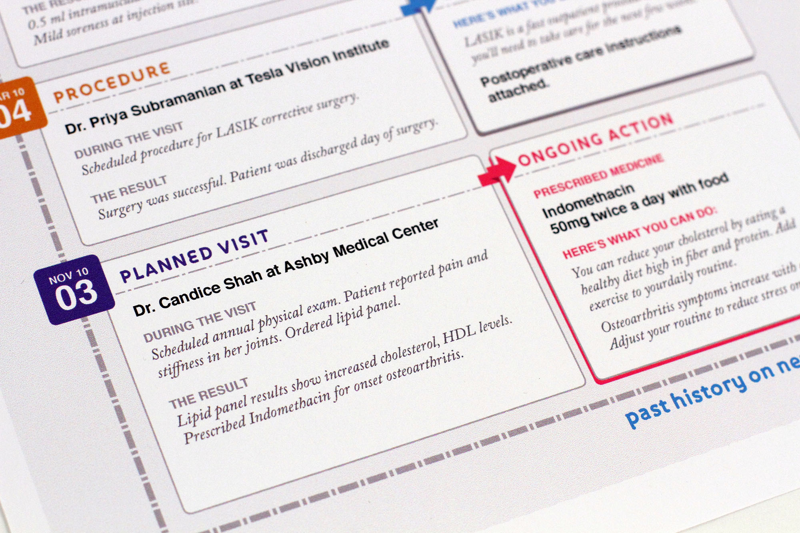
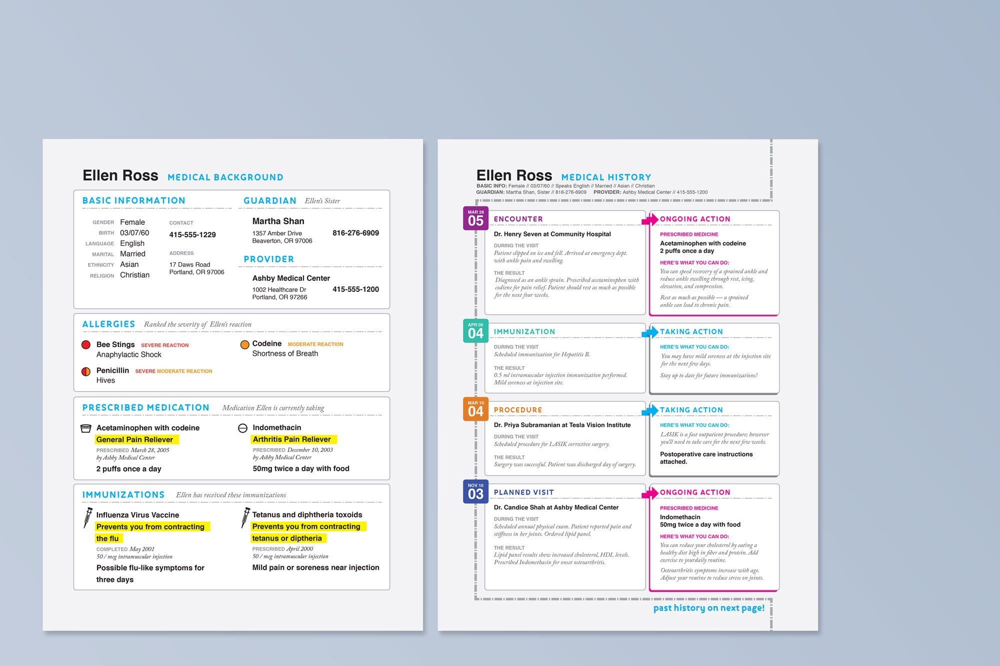

  

    

      <h2 class="section-headline">This was Blue Button</h2>
      
Millions of veterans and their families used it to access their VA health records that looked just like this one...

    

  

  

    

      

      # Demographics 
      First Name: Ellen 
      Last Name: Ross 
      Gender: Female 
      Martial Status: Married 
      Religious Affiliation: Christian 
      Ethnicity: Asian 
      Language Spoken: English 
      Address: 17 Daws Road, Portland, OR 97006 
      Telephone: 415-555-1229 
      Birthday: March 7, 1960 
      

      

      # Guardian 
      Role: Sister 
      First Name: Martha 
      Last Name: Shan 
      Address: 1357 Amber Drive, Beaverton, OR 97006 
      Telephone: 816-276-6909 
      

      

      # Provider 
      Name of Provider: Ashby Medical Center 
      Address: 1002 Healthcare Dr, Portland, OR 97266 
      Telephone: 415-555-1200 
      

      

      # Allergies 
      Allergy Name: Penicillin 
      Reaction: Hives 
      Severity: Moderate to severe 
      

      

      Allergy Name: Codeine 
      Reaction: Shortness of Breath 
      Severity: Moderate 
      Allergy Name: Bee Stings 
      Reaction: Anaphylactic Shock 
      Severity: Severe 
      

      

      # Immunizations 
      Date: May 2001 
      Immunization Name: Influenza virus vaccine, IM 
      Type: Intramuscular injection 
      Dose Quantity (value / unit): 50 / mcg 
      Education/Instructions: Possible flu-like symptoms for three days 
      

      

      Date: April 2000 
      Immunization Name: Tetanus and diphtheria toxoids, IM 
      Type: Intramuscular injection 
      Dose Quantity (value / unit) 50 / mcg 
      Education/Instructions: Mild pain or soreness in the local area 
      

      

      # Medication 
      Date: March 28, 2005 
      Type: Liquid 
      Name of Medication: Acetaminophen with codiene 
      Instructions: 2 puffs once a day 
      Dose Quantity (value / unit): 2 / puffs 
      Rate Quantity (value / unit): 1 / day 
      Name of Prescriber: Ashby Medical Center 
      

      

      Date: December 10, 2003 
      Type: Tablet 
      Name of Medication: Indomethacin 
      Instructions: 50mg bid with food 
      Dose Quantity (value / unit): 50 / mg 
      Rate Quantity (value / unit): 2 / day 
      Name of Prescriber: Ashby Medical Center 
      

      

      # Plan of Care 
      Planned Activity Name: Office consultation 
      Planned Date: May 28, 2007 
      Instructions: Consultation with Dr. George Potomac for Asthma 
      

      

      Planned Activity Name: Chest X-Ray 
      Planned Date: June 1, 2007 
      Instructions: 
      

      

      Planned Activity Name: Sputum Culture 
      Planned Date: May 28, 2007 
      Instructions: 
      

      

      # Encounters 
      Encounter: ED Visit for Ankle Sprain 
      Provider: Dr. Henry  Seven
      Location: Community Hospital 
      Date: March 28, 2005 
      

      

      Encounter: Gall Bladder Surgery 
      Provider: Dr. Bala Venktaraman 
      Location: Ashby Medical Center 
      Date: September 28, 2002 
      

      

      Encounter: Labor and Delivery 
      Provider: Dr. Tiffany Martinez 
      Location: Ashby Medical Center 
      Date: March 21, 2002 
      

      

      Encounter: ED Visit for Acute Cholecystitis 
      Provider: Dr. Tim Lee 
      Location: Ashby Medical Center 
      Date: October 28, 2001 
      

      

      # Problem List 
      Observation: Ankle Sprain 
      Status: Active 
      Date: March 28, 2005 
      Comments: Slipped on ice and fell. 
      

      

      Observation: Cholecystitis 
      Status: Resolved 
      Date: September 28, 2002 
      Comments: Surgery postponed until after delivery 
      

      

      # Procedures 
      Procedure: Laparoscopic Cholecystectomy 
      Date: September 28, 2002 
      Provider: Dr. Bala Venktaraman 
      Location: Ashby Medical Center 
      

      

      Procedure: Cesarian Section 
      Date: March 22, 2002 
      Provider: Dr. Tiffany Martinez 
      Location: Ashby Medical Center 
      

    

  

  

    

      <h2 class="section-headline">Hard to read?</h2>
      
The Office of the National Coordinator for Health Information Technology and the Department of Veteran Affairs thought so too.

    

  

  

    

      <h2 class="section-headline">The Challenge</h2>
      
The Office of the National Coordinator challenged designers around the nation to redesign the Blue Button patient health record to address these design objectives.

    

  

  

    

      
01. Improve the visual layout and style of the information from the medical record

    

    

      
02. Create a human-centered design that makes it easier for patient to manage their health

    

    

      
03. Enable health professionals to more effectively understand and use patients' health information

    

    

      
04. Help family members and friends care for their loved ones

    

  

  

    

      <h2 class="subsection-headline">Sections and Fields</h2>
    

    

      
<strong>Demographics:</strong> First Name, Last Name, Gender, Martial Status, Religious Affiliation, Ethnicity, Language Spoken, Address, Telephone, Birthday.

      
<strong>Guardian:</strong> Role, First Name, Last Name, Address, Telephone

      
<strong>Provider:</strong> Name of Provider, Address, Telephone

      
<strong>Allergies:</strong> Allergy Name, Reaction, Severity

    

    

      
<strong>Immunizations:</strong> Date, Immunization Name, Type, Dose Quantity (value / unit), Education / Instructions

      
<strong>Medication:</strong> Date, Type, Name of Medication, Instructions, Dose Quantity (value / unit), Rate Quantity (value / unit), Name of Prescriber

      
<strong>Plan of Care:</strong> Planned Activity Name, Planned Date, Instructions

      
<strong>Encounters:</strong> Encounter, Provider, Location, Date

    

    

      
<strong>Problem List:</strong> Observation, Status, Date, (Age at onset)

      
<strong>Procedures:</strong> Procedure, Date, Name of Organization, Address

      
<strong>Lab Results:</strong> Components, Result, Standard Range, Units

    

  

  

    

      <h2 class="subsection-headline">Commonly Ordered Tests and Components</h2>
    

    

      
<strong>Lipid Panel:</strong> Cholesterol, HDL, Non-HDL, Triglyceride, LDL

      
<strong>Complete Blood Count:</strong> Red blood cells, White blood cells, Hemoglobin, Hematocrit, Average red blood cell size, Hemoglobin amount per cell, Hemoglobin concrentation per red blood cell

    

    

      
<strong>Urinalysis:</strong> Appearance / color, Odor, Turbidity, Specific gravity, Acidity (pH), Glucose, Ketones, Protein, Bilirubin, Red blood cells, White blood cells, Casts, Crystals, Bacteria, Parasites, Leukoesterase, Nitrites

      
<strong>Pap Smear:</strong> Result (Positive / Negative)

    

  

  

    <figure>
      
    </figure>
  

  

    
Challenge.gov's Healthcare Record Design Challenged charged us with reconsidering the following: How might we design a more accessible healthcare record? In a two day sprint, our team designed a winning entry that approached healthcare history as a narrative.

    
After pouring through the sample data of the challenge, we quickly realized the lack of clarity with current text-only medical records, Although inaccessible and nearly illegible, the real problem was the layout. Our sample patient's medical history was full of past events that affected her future; a fall on the ice three winters ago led to chronic ankle pain that she experienced to the present.

    
Our final prototype emphasized the cause and effect that healthcare has on our daily lives. Details with an impact include color-coding visits (planned checkups versus unexpected emergencies), plain language explanations, and a dead simple medication section that <strong>nabbed us a 3rd place medal</strong>. You can see our entry (titled Blue Button Narrative), and others, at the <a href="http://healthdesignchallenge.com" target="\_blank">d.collab website</a>.

  

  

    
Our design was one of a dozen national finalists.

  

  

    <figure>
      
    </figure>
  

  

    <figure>
      
    </figure>
  

  

    <figure>
      
    </figure>
  

  

    <figure>
      
    </figure>
  

