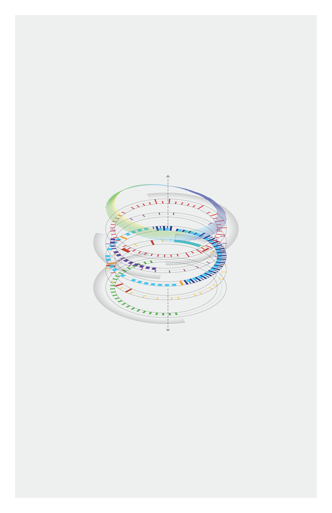

  

    

      
    

    

      

        
I created a set of diagrams for a friend's concept design for a flexible, programmable indoor-outdoor space for community events.

        
The purpose of the diagrams is to artistically communicate the diversity of community-supporting activities that can take place in the space and their dynamic with climatic and community conditions that change through the year.

        
The rings allude to the circular nature of time and elliptical form of the design structure.

      

      
    

    

      
      

        
The activity rings begin to pull apart, gently revealing distinctive patterns...

      

    

    

      

        
The rings are fully separated. Activities are segregated between rings by their type. We can see how warm weather coincides with the farmers' market and children's summer vacation activities schedule.

      

      
    

    

      
    

    

      
      

        
I worked mainly in Rhinoceros 3D, which gave me precise control over angles and dimensions and advanced topological tools that aren't available in conventional graphics programs.

        
Monthly average daily temperature highs and lows were plotted by height on two concentric rings. Intermediary data points were interpolated. 

      

    

    

      
    

    

      
      

        
The diagrams were then colored and finished in Adobe Illustrator.

      

    

  

