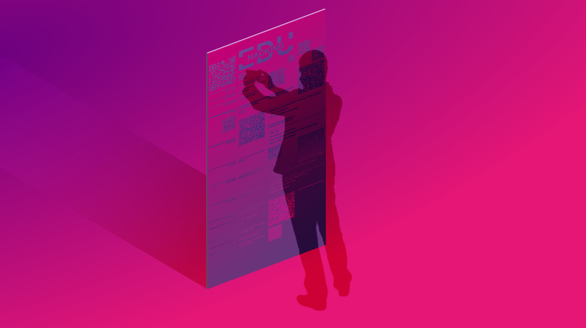
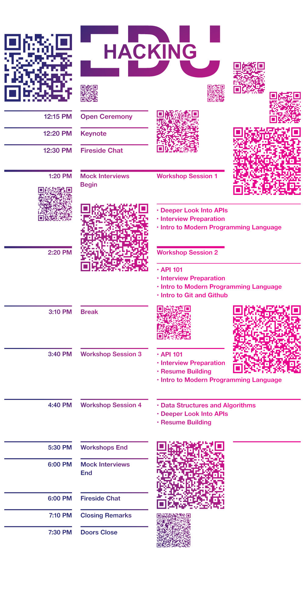

  

    

      
    

    

      

        
In 2016, I did a spec design for a student hackathon event schedule banner. Most event banners are passively graphic objects that stand unnoticed. This one was designed to be engaging and information-rich.

        
The banner is 6 feet tall and 3 feet wide. Like any schedule, the itinerary of breaks, workshops, and times are listed. QR codes serve as striking visual elements and provide an additional layer of detailed but nonessential information about events that can be scanned by interested viewers.

      

      

        
      

    

  

