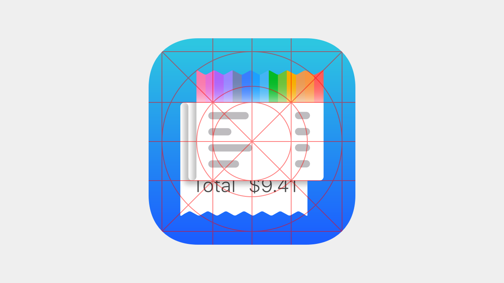

<link rel="stylesheet" href="https://www.apple.com/wss/fonts?family=Myriad+Set+Pro&v=2" type="text/css" media="all">

  

    
    

      
An iOS app icon is a super-elliptical square, or “squircle”. A receipt is a long and narrow rectangle. The representation of a full receipt within the app icon results in an unevenly balanced composition:

      

      
I first attempted to balance the composition by truncating the receipt length. However, truncation impacted how the rectangle would be "read" as a receipt instead of as some other paper object.

      

      
I had to find another way to adjust proportions of the object to match those of the app icon while keeping it representational of a receipt. My solution was to fold the receipt object. The solution <strong>reduced the object's vertical profile without truncating the object.</strong>

      

      
The perspective was skewed slightly leftward so that the viewer can see the object's folded edges and thinness. The object was not neatly folded and pressed so much as it was softly furled, resulting in edge curves that confer the <strong>illusion of a paper-like materiality</strong> upon an immaterial digital object.

      
To reinforce the idea of the digital paper object as a receipt, I added abstracted line items and made the top and bottom edges serrated. The serrated edges are a gesture toward the old receipt printers that would require a cashier to manually tear a newly printed receipt against metal teeth, leaving the receipt paper with characteristically serrated edges. I chose to leave the total price line readable and concrete because it succinctly <strong>summarizes the transaction-summarizing purpose of a receipt.</strong>

      

      
I decided that the app icon should depict not only a receipt but the digital receipt that is at the core of the app. The most visually striking feature of the digital receipt is its colorful header. Since the receipt header color is not defined by a single color but by a wide spectrum representing the types of places the user can get receipts from, I chose a vibrantly rainbow-hued band for the icon's representational receipt to <strong>symbolize the versatile and multifaceted nature of the app's digital receipt.</strong>

      

      
For the final design, I applied soft shadows and gradients to enhance the materiality of the receipt. I chose a deep blue-cyan gradient as the background because it stood well against the colorful header and crisp white paper of the receipt.

      

    

  

