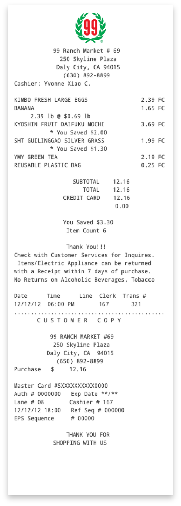

  <!--
  

    

      <h1 class="section-headline">Receipts for iOS</h1>
    

    

      <ul class="rundown">
        <li>Project Info</li>
        <li>Role: Designer, Investigator</li>
        <li>Areas: User Interface Design, User Experience Design, Interaction Design, Motion Design</li>
      </ul>
    

    

    

  

  -->
  
<iframe src="https://player.vimeo.com/video/206012454" width="640" height="359" frameborder="0" webkitallowfullscreen="" mozallowfullscreen="" allowfullscreen=""></iframe>

<!--

  

    

      <video class="w-100" preload="auto" muted playsinline autoplay loop poster="{{ site.baseurl }}/images/receipts_poster.png">
        <source src="{{ site.baseurl }}/images/receipts_wt.mp4">
      </video>
    

  

  

    

    <h1 class="section-headline"><strong>Receipts</strong> for iOS</h1>

    
Receipts detail our purchases and chronicle our daily journeys. In an increasingly cashless and paperless world, physical receipts are relics.

    
Meet Receipts, a concept iOS system app for contactlessly receiving, securely storing, and finding your digital receipts.

  

-->

  

    <h2 class="section-headline">Download receipts wirelessly</h2>
  

  

    
How would you like your receipt? Printed, emailed, texted, or sent wirelessly to your phone? Simply hold your iPhone near an NFC-enabled payment terminal that supports digital receipts when you check out.

  

  

    <figure>
      
    </figure>
  

  

    <h2 class="section-headline">The Problem</h2>
  

  

    
Our receipts exist in a balkanized state: printed receipts lie in piles, folders, or drawers, while electronic receipts hide in emails, text messages, or behind store web portals. Most receipts are inconsequential. We don't think about them until we need them most when the fridge stops working, the TV gets bricked by a bad update, or that new pair of jeans turns out to have a hole in the back. (How embarrassing.)

    
How can we bring receipts into the 21st century?

  

  

    <h2 class="section-headline">User Research</h2>
  

  

    
Through user interviews, I learned that users have unique organizational methods for dealing with receipts.

    <ul>
      <li>People develop their own unique ways of organizing receipts.</li>
      <li>Consequently, people have their own unique ways of finding receipts.</li>
      <li>People aren't uniformly organized or disorganized.</li>
      <li>People remember few details or features about their receipts.</li>
      <li>Receipts can hold sentimental value when they're associated with a significant memory.</li>
    </ul>

    
<a class="expand">Read more...</a>

    

      
I started by interviewing a dozen individuals. From these interviews, I learned several key insights that I have summarized below.

      
<strong>People develop their own unique ways of organizing receipts.</strong> Several interviewees reported that they would tape receipts to the original boxes of appliances, electronics, and other significant purchases. Some would file away important receipts and discard unimportant ones. Others did not take a disciplined approach, indiscriminately stashing receipts in kitchen drawers or letting receipts pile up in their wallets or purses.

      

      
<strong>Consequently, people have their own unique ways of finding receipts.</strong> Interviewees reported difficulty finding receipts when they mix receipt storage strategies. "Did I put the receipt in the kitchen drawer? In the box? In my bag upstairs? I can't remember exactly."

      
<strong>People aren't uniformly organized or disorganized.</strong> Their best efforts to organize can succumb to shortage of time or energy, resulting in mixed receipt ad hoc storage strategies.

      
<strong>People remember few details or features about their receipts.</strong> Human memory is fragile, fallible, and suggestible. The more distant a memory, the more muddled it becomes. "Where did I put that receipt for the ladder from Home Depot? Or was it Lowe's?"

      
<strong>Receipts can hold sentimental value when they're associated with a significant memory.</strong> Several interviewees reported having kept old receipts from a memorable date night or trip. A few reported having shared funny, outrageous, or otherwise interesting receipts on social media.

      
My takeaways:

      <ul>
        <li>Because people develop their own unique ways of organizing receipts, the design solution should provide organizational flexibility to users.</li>

        <li>Because people have their own unique ways of finding receipts, the design solution should support multiple and diverse search methods.</li>

        <li>Because people aren't uniformly organized or disorganized, the design solution should make it easy for users to keep a good organizational baseline.</li>

        <li>Because people remember few details or features about their receipts, the design solution should support user search with incomplete information.</li>

        <li>Because receipts can hold sentimental value when they're associated with a significant memory, the design solution should be mindful about what a receipt can signify and be open-minded about what users want to do with their own receipts.</li>
      </ul>

      
Here I did not conclude user research but continued it throughout the design process as I investigated the potential efficacy of proposed features through interviews and paper prototypes.

    

  

  

    <h2 class="section-headline" id="business-research">Business Research</h2>
  

  

    
I researched the business and technological landscape to learn about the technical and business feasibility of my ideas.

    <ul>
      <li>The National Retail Federation, a merchant consortium, sponsors an electronic receipt XML schema standard for application-to-application integration, thereby ensuring interoperability between disparate equipment in a point of sale system.</li>
      <li>Though the schema is currently enterprise-facing, it is technically feasible for standardized electronic receipts to be transmitted by near-field communication.</li>
      <li>Electronically receipted return fraud is the fastest growing type of return fraud and is a growing concern for retailers. Mobile operating systems offer robust security and identification capabilities that can be applied toward combating receipt fraud.</li>
    </ul>

    
<a class="expand">Read more...</a>

    

      
Electronic point of sale, or POS, systems originated in the 1970s and have undergone tremendous development and changed since then. Today, they are divided in two categories: traditional and cloud-based.

      
<strong>Traditional POS systems</strong> comprise of equipment often from different manufacturers: cash drawers, scanners, receipt printers, cashier-facing and customer-facing POS terminal displays, and payment terminals are interoperable because they share manufacturer-neutral APIs. Connected to switch networks, POS systems back up transaction information to store or company servers. Whether or not a traditional POS system supports newer payment methods like NFC is determined by its payment terminal.

      
<strong>Cloud-based systems</strong> were introduced in the 2000s, following the expansion of web services and the growing availability of affordable mobile devices. Cloud-based systems support all old and most newer payment methods. All systems offer receipts in both old and new formats. Cloud-based systems are connected to web services and receipts are hosted and made accessible online to customers. Companies like Square and Clover market and sell complete POS systems like the one pictured above.

      
The National Retail Federation, or NRF, a merchant consortium, established as a division the Association for Retail Technology Standards, or ARTS. The ARTS established in the late 1990s manufacturer-neutral APIs and XML schemas that enable POS peripherals by different manufacturers to work together as a coherent system. IXRetail, established by the ARTS in the early 2000s, provides an XML schema for electronic receipts.

      
At the end of 2015, the NRF reported in its <a class="external-link" href="https://nrf.com/sites/default/files/Images/Media%20Center/NRF%20Retail%20Return%20Fraud%20Final_0.pdf" target="\_blank">2015 Return Fraud Survey</a> that "fraudulent e-receipted returns" had increased by 86% over the last year, representing the top growth area for return fraud. The shortfalls of current electronic receipts are non-exhaustively enumerated in <a class="external-link" href="https://nrf.com/news/the-dark-side-of-e-receipts" target="\_blank">an NRF publication</a>: they "are easy to transmit, easy to alter, susceptible to cloning and forgery and hard to permanently delete once saved to storage media."

      
My takeaways:
      <ul>
        <li>Because nearly all POS equipment manufacturers follow ARTS-established standards for interoperability and data interchange, I reasoned that, after having consulted software engineer peers, it is technically feasible for standardized electronic receipts to be exchanged over NFC in the near future.</li>
        <li>Because of the growing problem of electronic receipt return fraud and the powerful security and identification capabilities offered by the ubiquitous smartphone operating system iOS, there is opportunity to create highly secure standardized electronic receipts that would embraced by merchants.</li>
      </ul>
      

    

  

  

    
  

  

    <h2 class="section-headline" id="defining-the-app">Defining the App</h2>

    
Receipts was conceived as a lightweight utility app to help people keep track of their digital receipts. The app <strong>does not</strong> track expenses, calculate budgets, or provide business reviews, all services which should be left to other apps to handle. 

    <ul>
      <li>App's core purpose and service is to help people receive and store receipts. Other services like expense or budget tracking can be better provided by other apps.</li>
      <li>App's core purpose tightly circumscribes its architecture.</li>
      <li>Permeable architecture with multiple app entry and exit points.</li>
      <li>Architecture was both elaborated upon and pruned as research and design progressed. The flow chart shown here represents the app architecture in its final iteration.</li>
    </ul>

    
<a class="expand">Read more...</a>

    

      
Receipts was conceived as a lightweight utility app to contactlessly exchange and organize receipts.  The app <strong>does not</strong> track spending or calculate budgets, show business reviews, or provide financial advice. These services should be left to other apps to handle. 

      
The digital receipt is the raison d'être for the app, thus the app must be designed with a tight focus on the receipt. Without functions extraneous to the app's core purpose, the app architecture could be kept shallow with all states separated by no more than three interactions. Each interaction pushes the user toward the receipt they seek.

      
The app architecture was made highly permeable with multiple entry points to different depth levels within the app and multiple exits.

    

  

  

    

      <h2 class="section-headline">Sketches and Scribbles</h2>
    

    

      
Before I touched the mouse, I reached for pen and paper to feel out the problem space, brainstorm ideas to explore, work out requirements, and plan very rough, low-fidelity screens.

    

  

  <!--
  

    

      
    

    

      
    

    

      
    

  

  -->
  

    
  

  

    

      <h2 class="section-headline">Early Iteration</h2>
    

    

      
By building a basic but coherent core for an early iteration, I provided myself a project platform for building and adding on more ideas to flesh out the concept.

    

  

  

    <figure>
      
    </figure>
  

  

    

      <h2 class="section-headline">Late Iteration</h2>
    

    

      
Through continuous research, interviews, and critiques, the app was elaborated upon. Place icons and colors help the user distinguish between receipts. Enhanced search functionality enables the user to rapidly refine their search.

    

  

  

    <figure>
      
    </figure>
  

  

    

      <h2 class="section-headline" id="designing-a-better-receipt">Imagining A Better Receipt</h2>
    

    

      
It took me several iterations to design a clean and modern receipt that keeps the most important information front and center, and is easy to find and identify.

      
I sifted through <i>hundreds</i> of receipts. At first, I saw few unifying elements. Most elements differed wildly in their placement, inclusion, and language.

      
How can we bring order to such chaos?

    

  

  

    

      <h2 class="section-headline">Iteration 01</h2>
    

    

      <ul class="rundown">
        <li>Summary</li>
        <li>Design Design starting point</li>
        <li>Design Captures all receipt details as they are</li>
        <li>Feedback All the small details can overwhelm</li>
        <li>Insight Information density without hierarchy impairs readability</li>
      </ul>
    

    

      
    

    

      <h2 class="subsection-headline">Design Rationale</h2>
      
Initially, I thought that a receipt should appear on screen as it does on paper in order to capture all information, details, and nuances. Common receipt paper roll widths (2.25 and 3.125 inches) closely match iOS device screen widths (iPhones 6 & 7: 2.30 inches; iPhones 6 & 7 Plus: 2.6 inches) so a receipt <i>would</i> appear on screen closely as it does on paper.

      <h2 class="subsection-headline">Receiving and Reflecting on Feedback</h2>

      
User feedback revealed that my presupposition about total information capture was wrong. Information about the cashier's name or the checkout line number, as examples, were unimportant to users. Furthermore, such extraneous information reduced receipt readability, clarity, and flow.

      
I realized that the few unifying elements were shared by all receipts precisely because they were important, while other elements weren't shared precisely because they were unimportant to the core purpose of a receipt. From this insight I concluded that the common and thus important elements needed to be more <strong>salient</strong>.

    

  

  

    

      <h2 class="section-headline">Iteration 02</h2>
    

    

      <ul class="rundown">
        <li>Summary</li>
        <li>Design Pare down to the pertinent details</li>
        <li>Design Construct a logical information hierarchy</li>
        <li>Feedback Much more readable</li>
        <li>Feedback Still plain-looking</li>
        <li>Insight There are opportunities to simplify receipt-related actions</li>
        <li>Insight Distinguishability = visual distinctiveness = structure + style</li>
      </ul>
    

    

      
    

    

      <h2 class="subsection-headline">Design Rationale</h2>
      
I organized critical elements in a hierarchal structure that lent predictability to the new receipt design. People first search through receipts not by phone number or address but by business names and transaction dates, so I pared the receipt header down to those search-guiding details.

      
I chose to exclude business logos in this iteration because I couldn't find a way to present them in a consistent and high-quality manner. Some businesses had large and detailed logos that would significantly degrade into when shrunk. Conversely, others had logos that would degrade when enlarged.

      
The business location and contact details were relocated beneath the list of item names and prices, the core of the receipt. An embedded map supplements the business location details, providing highly salient geospatial information to the user.

      
<a class="expand">Read more...</a>

      

      

        
I allocated sections further below the receipt for payment transaction details and miscellaneous information like return policies or customer survey links. All sections were cleanly formatted and presented in an aesthetically-pleasing but neutral style.

        <h2 class="subsection-headline">Receiving and Reflecting on Feedback</h2>

        
User feedback was decidedly more positive. Test users found the second iteration design more readable, clear, and attractive but still "plain" in appearance and lacking in interactivity.

        
Reflecting but not yet acting on user feedback, I concurred that there was potential for interactivity. There are user scenarios—where the user dials the listed phone number, emails the listed email address, or looks up directions to the listed store address—that could benefit from improved flow through smart interactions.

        

        
Processing user feedback on visual appeal, which can often be fickle and vague, was more difficult. Upon deeper reflection, I developed a more useful interpretation of feedback about the "plain" second iteration receipts: they were visually indistinctive and unmemorable.

        
I realized that by having imposed a predictable structure I had in effect reduced the structural distinctiveness of an already stylistically indistinct design. Since visual appearance is composed of structure and style, <i>a structurally and stylistically indistinct design <strong>is</strong> a visually indistinct design</i>.

        

        
The implications of visually indistinct receipts for usability are not immaterial. It is well-established that people can better identify visually distinct objects. Consequently, increasing the visual distinctiveness of receipts will make them easier for users to find and identify.

      

    

  

  

    

      <h2 class="section-headline">Iteration 03</h2>
    

    

      <ul class="rundown">
        <li>Summary</li>
        <li>Design Interactive business contact details simplify common receipt-related actions</li>
        <li>Design Business details panel made translucent to suggest connection to yet separation from map beneath</li>
        <li>Design Colorful place icons help user quickly tell where receipt is from</li>
        <li>Feedback Highly readable</li>
        <li>Feedback Very visually distinguishable</li>
      </ul>
    

    

      
    

    

      <h2 class="subsection-headline">Design Rationale</h2>
      
Business contact details were made actionable through the addition of iconic buttons that allow users to initiate a phone call or an email message seamlessly from within the app. Normally, a user would copy contact details from a receipt and enter them into their phone or email apps.

      

      
To increase the visual distinctiveness and thus distinguishability of receipts, I graphically emphasized what first and foremost has set them apart: the businesses the receipts are from. I imported Apple Maps place marker iconography and colors to color-code receipt headers by the type of businesses they're from with vibrant hues.

      
I made other visual tweaks. Line-spacing was slightly tightened to compact the receipt while maintaining readability. The background panel behind the business information section was made a translucent diaphanous acrylic sheet that reveals yet obscures the map behind, suggesting a connection while maintaining separation.

      
<a class="expand">Read more...</a>

      

        

        <h2 class="subsection-headline">Receiving and Reflecting on Feedback</h2>

        
This time, user feedback was overwhelmingly positive. Test users found the receipts highly readable and attractive yet distinct and distinguishable. Test users could very quickly infer the contents of the receipt by a cursory glance at the receipt header. Though the receipts shown to test users were non-interactive prototypes, users gave feedback that they would appreciate the ability to quickly contact or locate businesses from within the receipts.

      

    

  

  

    

      <h2 class="section-headline" id="iconography">Places Iconography</h2>
      <ul class="rundown">
        <li>Summary</li>
        <li>Insight Apple Maps the most popular iOS map app by far</li>
        <li>Design Leverage users' basic familiarity with Apple Maps place icons and colors</li>
        <li>Design In turn, reinforce users' basic familiarity with Apple Maps place icons and colors</li>
      </ul>
    

    

      
Everyday, millions of people use Apple Maps to get directions and find destinations. It's the most popular map app on iOS, <a class="external-link" href="http://fortune.com/2015/06/16/apple-google-maps-ios/" target="\_blank">having far surpassed Google Maps in 2015</a>.

      
Apple Maps has its own bold and colorful language of place markers that identify types of businesses and attractions. I reasoned that, given Apple Maps' popularity, many iOS users have developed a basic familiarity of Apple Maps iconography: such basic familiarity is a user mental model resource.

      
Thinking ecologically, I recognized there's potential for a symbiotic relationship between Receipts and Maps. Receipts could leverage user familiarity with Maps iconography and, in turn, build on it. Over time, the symbiosis will strengthen users' mental associations between place types, place pictograms, and place colors.

      
A place icon can graphically imbue a digital receipt with a sense of where it's from. Users can search receipts not only by business name and location but also by place icon and color. As users' mental models strengthen through repeated use of Receipts and Maps, users will identify place icons and colors more quickly and reliably in both apps, thereby becoming becoming more effective at using the apps.

    

  

  

    <figure>
      
      <figcaption>Apple Maps place icons.</figcaption>
    </figure>
  

  

    <h2 class="section-headline" id="designing-for-search">Designing for Search</h2>
  

  

    
So far, we looked at one important half of the app equation: receiving receipts. What about the other half: retrieving receipts? Rarely do we ever look at or search for a receipt. We look at a receipt for the first and often final time when we are handed it, and for a second time when the purchase breaks.

    
As mundane by-products of our busy everyday lives, receipts aren't memorable. Although the small details of our receipts often escape us, their stories don't quite so easily—and stories are about context.

    
Users interviews reveal that people often remember the circumstances surrounding their purchases. Purchase memories are often entangled with other memories, like those of business trips or date nights.

    
How can we search for receipts in the way our minds search for memories?

    

      
For this phase of the project, I set out to design not obligatory screen views but tools to support users in searching for and organizing their receipts. From interviews, the most salient receipt details recalled by people came in three flavors: objective (what was bought?), temporal and chronological (when was it bought?), and spatial (where was it bought?).

      

      

      
I designed an interface with two modal views that support chronological and spatial search. Floating above those two views is a modeless panel that supports objective search and filter controls. The two modal views access and output the same information set that is controlled and filtered through the modeless panel.

      

      

    

  

  

    

      <h2 class="section-headline">Search by Time</h2>
    

    

      <ul class="rundown">
        <li>Summary</li>
        <li>Insight Don't fight against seasoned user mental models of operating system interfaces</li>
        <li>Design Swipe interaction conforms to user expectations for a list interface</li>
        <li>Design Place icons and colors help identify kinds of businesses receipts are from</li>
        <li>Design Summary costs signal significance of receipt contents</li>
        <li>Design Search and filter panels help the user quickly whittle down results</li>
      </ul>
    

    

      
    

    

      
In this view, receipts are displayed as list items in a layout similar to their receipt header. As mentioned, this layout was designed, with the theory that our minds "read" colors and shapes before words and phrases, to help users identify receipts fast.

      
In addition to the receipt header details, the list items also show summary transaction costs which signal the significance of receipt contents to the user and cues them on the probability of a receipt having a big-ticket purchase.

      
For example, if you were looking for the receipt for your new 4K UHD TV, you wouldn't expect it to be a receipt from a gas station or to have a summary cost under $1,000.

      
Speaking of expectations, we all carry—from one app or operating system to another—expectations for how interfaces should behave. Swiping on an individual item to reveal item management options is no longer  <a class="external-link" href="https://en.wikipedia.org/wiki/Mystery_meat_navigation" target="\_blank">"mystery meat navigation"</a> but is instead a near-ubiquitous interaction for item list views (at least in iOS).

      
Swiping to delete or move an item can get tedious for large groups. The good old Edit button allows the user to select multiple receipts for batch processing.

    

  

  

    

      <h2 class="section-headline">Search by Place</h2>
    

    

      <ul class="rundown">
        <li>Summary</li>
        <li>Insight People have strong spatial memory</li>
        <li>Design Seamless switching and coordination between list and map views</li>
        <li>Design Red dots represent geotagged receipts</li>
        <li>Design Receipt results for a location are displayed in bottom panel</li>
      </ul>
    

    

      

        <video class="w-100" preload="auto" muted playsinline autoplay loop poster="{{ site.baseurl }}/images/receipts/map-view.png">
          <source src="{{ site.baseurl }}/images/receipts/demo-screen-map.mp4">
        </video>
      

    

    

      
In the spatial search view, geotagged receipts are displayed as dots, which are colored red in order to contrast highly with the map background. Depending on the map zoom level, adjacent red receipt dots will merge as larger circles with item counts.

      
The map behaves very much like Apple Maps. Selecting a valid location will display, if there is only one  business there, a marker with the business name and place icon. If there are multiple businesses, then the marker will cycle through their names and icons.

      
Receipts tagged at a location will appear in the bottom panel and replace the search and filter options. Selecting a receipt will pull it up in the same manner as in the list view.

      
Too many locations on-screen? Zoom in or narrow down the selection by filtering out old receipts.

    

  

  

    

      <h2 class="section-headline">Wallet as Metaphor</h2>
    

    

      <ul class="rundown">
        <li>Summary</li>
        <li>Insight After checkout, the cashier hands you the receipt. Where do you put it? In your wallet.</li>
        <li>Design Find recent recent receipts in Wallet</li>
        <li>Design App prioritizes loading selected receipt before loading the rest of the app</li>
        <li>Design As app loads, interface accordingly provides graphical signifiers</li>
      </ul>
    

    

      

        <video class="w-100" preload="auto" muted playsinline autoplay loop poster="{{ site.baseurl }}/images/receipts_poster.png">
          <source src="{{ site.baseurl }}/images/receipts/demo-screen-wallet.mp4">
        </video>
      

    

    

      
I initially chose to pursue this project as a concept for a <i>first-party iOS system</i> app because the premise permitted me to explore access to the iPhone NFC reader chip and integration with system utility apps like Wallet.

      
Wallet is an iOS system app can hold the user's credit and debit cards, reward cards, boarding passes, and more for wireless use by near-field communication (NFC). Currently, users can see the last few charges made to their cards but cannot view detailed info about any transaction.

      
I observed that in the physical world, after getting their receipts from the cashier, people often put them in their physical wallets. Consequently, most people can find their latest receipts in their wallets. I thought that this relationship could be imported into the digital world and feel natural to users.

      
Here in the digital wallet, a user can find their last few receipts like how they would in their physical wallet. Receipt details are shown similar to how they are presented within the app itself. Selecting a receipt will launch or resume the Receipts app.

      
I had put a great deal of thought into designing a graceful app loading process. A blank receipt slip is first displayed to reassure the user that the right app was launched. The receipt header is loaded next to reassure the right receipt is loading, followed by the receipt's nitty gritty details. Finally, when, the rest of the app is loaded, a window tab appears behind the receipt and a pull handlebar appears at the top of the receipt to signify the receipt's pull affordance.

    

  

  

    <h2 class="section-headline" id="designing-the-icon">Designing the Icon</h2>
  

  

    
An iOS app icon is a super-elliptical square, or “squircle”. A receipt is a long and narrow rectangle. The representation of a full receipt within the app icon results in an unevenly balanced composition:

    

    
I first attempted to balance the composition by truncating the receipt length. However, truncation impacted how the rectangle would be "read" as a receipt instead of as some other paper object.

    

    
I had to find another way to adjust proportions of the object to match those of the app icon while keeping it representational of a receipt. My solution was to fold the receipt object. The solution <strong>reduced the object's vertical profile without truncating the object.</strong>

    

    
The perspective was skewed slightly leftward so that the viewer can see the object's folded edges and thinness. The object was not neatly folded and pressed so much as it was softly furled, resulting in edge curves that confer the <strong>illusion of a paper-like materiality</strong> upon an immaterial digital object.

    
To reinforce the idea of the digital paper object as a receipt, I added abstracted line items and made the top and bottom edges serrated. The serrated edges are a gesture toward the old receipt printers that would require a cashier to manually tear a newly printed receipt against metal teeth, leaving the receipt paper with characteristically serrated edges. I chose to leave the total price line readable and concrete because it succinctly <strong>summarizes the transaction-summarizing purpose of a receipt.</strong>

    

    
I decided that the app icon should depict not only a receipt but the digital receipt that is at the core of the app. The most visually striking feature of the digital receipt is its colorful header. Since the receipt header color is not defined by a single color but by a wide spectrum representing the types of places the user can get receipts from, I chose a vibrantly rainbow-hued band for the icon's representational receipt to <strong>symbolize the versatile and multifaceted nature of the app's digital receipt.</strong>

    

    
For the final design, I applied soft shadows and gradients to enhance the materiality of the receipt. I chose a deep blue-cyan gradient as the background because it stood well against the colorful header and crisp white paper of the receipt.

    

  

  

    <h2 class="section-headline" id="conclusion-and-reflections">Conclusion and Reflections</h2>
  

  

    
Thanks for checking out my work. I had worked hard on this project for over a month. 

    
I spent most of my project time on research and debate. Whenever I discovered new insights, I debated their validity and applicability with myself and my friends who work in design and software engineering. I also offered up my design decisions for critique. Had I chosen not to have my work challenged, the project could have been completed in less than week but would have suffered from insufficient criticism.

    
The Receipts app was imagined and conceived as a first-party iOS system app, but there are no plans to implement it. It was a productive design exercise. I hope to someday to be in a position where I can work on a product that's part of a complex product and user ecosystem.

    
I worked alone on the project, so there was only so much I could do. Had I more time and resources, I would have pushed the design further along certain dimensions:

    <ul>
      <li>Though I did limited testing of certain features or designs, like asking users to search for a specific receipt in a pile of samples, full application usability testing was outside my reach because it would entail building and deploying a fully functional app. I would like to see how users put the app to work in managing real, not sample, receipts.</li>
      <li>I did not deeply investigate the app's usability for elderly or handicapped users. I cannot say for sure whether or not the app's interactions can be easily carried out by a user with motor impairments. This is an area I would like to investigate further.</li>
      <li>I imagined NFC receipts as the ubiquitous method for receiving receipts in the future. Until that future arrives, what do users do in the meanwhile? I imagine the user using their camera to scan a QR code or capture a print receipt, or using the app to scan their email inbox for electronic receipts. Though I had given considerable thought to these edge cases, I would have liked to explored them in the design.</li>
    </ul>

  

